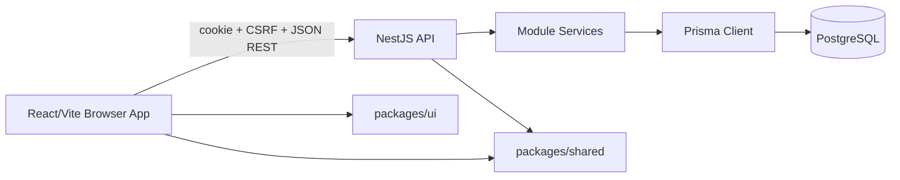

# Architecture

## Current Architecture

The project is a modular TypeScript monorepo managed with pnpm.

## Workspaces

| Workspace | Responsibility |
|---|---|
| `apps/api` | NestJS REST API, auth, RBAC, services, Prisma, audit, demo seed. |
| `apps/web` | React/Vite SPA, route guards, feature pages, query/cache, forms. |
| `packages/shared` | Shared contracts, enums, pure helpers used by API and web. |
| `packages/ui` | Reusable responsive UI components and styles. |
| `packages/config` | Shared TypeScript config. |

## Backend Flow

Requests enter NestJS controllers. Protected routes use auth, CSRF for mutating methods, permission guards, and legal entity context guards where needed. Controllers delegate to services. Services own business rules, transactions, audit writes, and Prisma persistence. View mappers shape API responses and mask sensitive fields.

## Frontend Flow

React Router defines public and authenticated routes. `AuthenticatedRoute` loads auth state. `PermissionRoute` checks current permission keys for navigation and route access. Feature API files call `apiFetch`, TanStack Query owns cache, and mutations invalidate related query keys.

## Auth And Context

Sessions are stored server-side. Cookie auth uses `dl_session`; CSRF uses `dl_csrf` and `x-csrf-token`. `Session.activeLegalEntityId` stores the active company context for `NC`/`NG`.

## Module Boundaries

Modules are organized under `apps/api/src/modules`. Cross-cutting modules include `auth`, `rbac`, `database`, `organization-context`, and `health`. Domain modules include works, pricing, deadlines, workflow, logistics, delivery, billing, patients, clinics, settings, users, QR, and scan.

## Shared Contracts

`packages/shared` is the preferred place for typed API-facing values and pure UI helpers that are shared by API and web. It must not contain server-only database logic or browser-only rendering logic.

## Audit

Critical mutations use `AuditService` and resource-specific constants. Audit entries are implemented in the database, while an audit UI is planned.

## QR

QR codes contain opaque tokens/identifiers and resolve through backend endpoints. Work detail visibility remains permission-controlled.

## Demo Seed

Demo seed is deterministic and idempotent. It creates local users, clinics, doctors, patients, work types, workflow templates, works, claims, execution snapshots, billing, logistics, deliveries, and signatures.

## Approved Future Boundaries

- Materials and inventory should be separate modules.
- Search should be a backend aggregation/search module with permission-aware result shaping.
- Reports should separate operational and financial visibility.
- Audit UI should read existing audit data.

## Deferred Infrastructure

No Kubernetes, microservices, Elasticsearch, queue infrastructure, or external payment/POS integration exists. Do not document or implement those unless explicitly approved.
