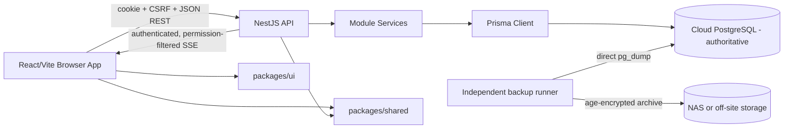

# Architecture

## Current Architecture

The project is a modular TypeScript monorepo managed with pnpm.

## Workspaces

| Workspace | Responsibility |
|---|---|
| `apps/api` | NestJS REST API, auth, RBAC, services, Prisma, audit, demo seed. |
| `apps/web` | React/Vite SPA, route guards, feature pages, query/cache, forms. |
| `packages/shared` | Shared contracts, enums, pure helpers used by API and web. |
| `packages/ui` | Reusable responsive UI components and styles. |
| `packages/config` | Shared TypeScript config. |

## Backend Flow

Requests enter NestJS controllers. Protected routes use auth, CSRF for mutating methods, permission guards, and legal entity context guards where needed. Controllers delegate to services. Services own business rules, transactions, audit writes, and Prisma persistence. View mappers shape API responses and mask sensitive fields.

## Frontend Flow

React Router defines public and authenticated routes. `AuthenticatedRoute` loads auth state. `PermissionRoute` checks current permission keys for navigation and route access. Feature API files call `apiFetch`, TanStack Query owns cache, and mutations invalidate related query keys. `RealtimeSync` receives safe semantic events and invalidates only mapped query prefixes; the refetched API response remains authoritative.

## Auth And Context

Sessions are stored server-side. Cookie auth uses `dl_session`; CSRF uses `dl_csrf` and `x-csrf-token`. `Session.activeLegalEntityId` stores the active company context for `NC`/`NG`.

## Module Boundaries

Modules are organized under `apps/api/src/modules`. Cross-cutting modules include `auth`, `rbac`, `database`, `organization-context`, and `health`. Domain modules include works, pricing, deadlines, workflow, logistics, delivery, billing, patients, clinics, settings, users, QR, and scan.

## Shared Contracts

`packages/shared` is the preferred place for typed API-facing values and pure UI helpers that are shared by API and web. It must not contain server-only database logic or browser-only rendering logic.

## Audit

Critical mutations use `AuditService` and resource-specific constants. Audit entries are implemented in the database, while an audit UI is planned.

## Realtime Synchronization

Authenticated browsers connect to `GET /realtime/events` with cookie credentials. The Nest interceptor describes only successful mutating responses after service/transaction completion. It publishes a small envelope containing event ID, timestamp, semantic type, and authorized topics, never a database row or financial/patient payload.

`RealtimeAudienceService` filters every topic against current server-side permissions before delivery. Financial events require a financial permission even when the mutation also affects a generic query family. Targeted auth and own-earnings events additionally enforce user identity. Sessions are periodically revalidated; expiration, deactivation, or access changes close the stream.

The browser uses native EventSource reconnection, deduplicates recent event IDs, coalesces short bursts, and maps topics to TanStack Query prefixes. A `ready` event refreshes active queries to cover events missed during connection or reconnection. Conservative polling remains only as a 120-second recovery fallback.

The current broker is intentionally in-memory for one API replica. Its interface is replaceable. More than one API replica requires a shared pub/sub adapter and distributed/WAF rate limiting before rollout; otherwise cross-replica events can be missed.

## Deployment Profiles And Source Of Truth

Both supported profiles have one writable cloud PostgreSQL database:

- Hybrid Cloud + NAS: cloud database is live; NAS receives encrypted backups only.
- Cloud only: cloud database is live; provider recovery plus an independent encrypted cloud copy replaces the NAS layer.

There are no customer-name branches, dual writes, or live NAS requirements in domain code. Uploaded attachments are stored in PostgreSQL, so they follow the same transactional and backup boundary. Generated invoices/statements/exports are derived from persisted snapshots on demand.

See [PRODUCTION-RUNBOOK.md](PRODUCTION-RUNBOOK.md) and [BACKUP-RESTORE.md](BACKUP-RESTORE.md).

## QR

QR codes contain opaque tokens/identifiers and resolve through backend endpoints. Work detail visibility remains permission-controlled.

## Demo Seed

Demo seed is deterministic and idempotent. It creates local users, clinics, doctors, patients, work types, workflow templates, works, claims, execution snapshots, billing, logistics, deliveries, and signatures.

## Approved Future Boundaries

- Materials and inventory should be separate modules.
- Search should be a backend aggregation/search module with permission-aware result shaping.
- Reports should separate operational and financial visibility.
- Audit UI should read existing audit data.

## Deferred Infrastructure

No Kubernetes, microservices, Elasticsearch, queue infrastructure, shared realtime broker, distributed rate limiter, malware scanner, or external payment/POS integration exists. Do not present any of these as deployed. Add them only from measured need and an approved design.
