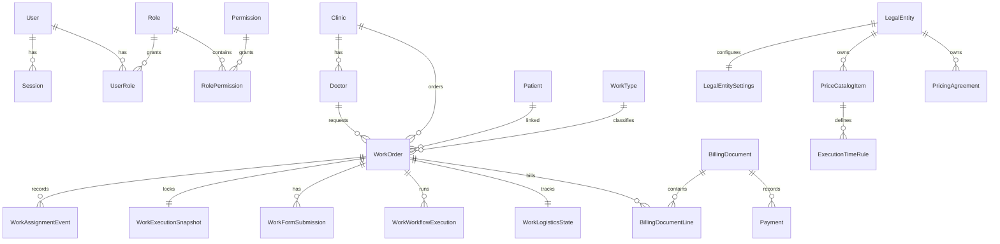

# Domain Model

This document summarizes confirmed domain entities. Implementation details are in `apps/api/prisma/schema.prisma`.

## Implemented Models

| Entity | Purpose | Key invariants/status |
|---|---|---|
| User | Internal account. | Active flag gates access; password hash never exposed; versioned. Implemented. |
| Role, Permission, UserRole, RolePermission, UserPermissionOverride | RBAC. | Backend source of truth; deny override wins. Implemented. |
| Session | Server-side auth session. | Stores token hash and active legal entity. Implemented. |
| AuditLog | Critical action record. | Written by services. Implemented; UI planned. |
| LaboratorySettings | Legacy singleton settings. | Retained for compatibility. Implemented. |
| LegalEntity, LegalEntitySettings | `NC`/`NG` company context and settings. | Active context affects company-aware APIs. Implemented. |
| Clinic, Doctor | External clinics and doctors. | Doctors belong to clinics; archive/restore supported. Implemented. |
| Patient | Patient identity. | Linked to work orders; no internal patient code as business identifier. Implemented. |
| WorkType | Operational work category. | Price base and form/workflow links. Implemented. |
| PriceCatalogItem, ExecutionTimeRule | Company price and execution-time base. | Company-specific; money minor units. Implemented. |
| PricingAgreement, PricingAgreementRule | Clinic/doctor negotiated pricing. | Precedence: doctor, clinic, catalog. Implemented. |
| WorkOrder | Core work record. | Code, clinic, doctor, patient, work type, QR, deadline, ownership, workflow. Implemented. |
| WorkAssignmentEvent | Append-only claim/release/reassign history. | Records revision and snapshot references. Implemented. |
| WorkExecutionSnapshot | Locked execution context. | One per work; stores company, technician, pricing, deadline snapshots. Implemented. |
| WorkFormTemplate, WorkFormFieldDefinition, WorkFormSubmission | Dynamic forms. | Templates versioned; submissions snapshot responses. Implemented. |
| WorkflowTemplate, WorkflowStageDefinition, WorkWorkflowExecution, WorkStageExecution, WorkStageEvent | Workflow templates and runtime execution. | Ordered stages and event timeline. Implemented. |
| WorkLogisticsState, LogisticsEvent, DeliveryPreparationGroup, DeliveryPreparationItem | Physical logistics flow. | Location/block/packing/group transitions. Implemented. |
| Delivery, DeliveryEvent, DeliveryProof | Courier delivery and proof. | Delivery transitions and internal signature proof. Implemented. |
| BillingDocument, BillingDocumentLine, Payment, BillingSeries | Proformas, invoices, payments, numbering. | Manual payments only; overpayment rejected by billing rules. Implemented. |

## Planned Models

Materials and inventory are planned. Concepts include material catalog, stock, NIR, bon de consum, adjustments, transfers, returns, loss/scrap, and traceability. Schema is not finalized.

Reports, search indexes, notifications, and audit UI are planned at product level but not database-finalized.

## Identifier Policy

Internal database IDs exist in Prisma. API responses should expose only identifiers needed for frontend contracts and never expose internal IDs unnecessarily. QR tokens are opaque.

## Audit Requirements

Audit critical creates, updates, archives, status transitions, claims, releases, reassignments, pricing changes, deadline changes, billing/payment actions, logistics/delivery transitions, and security-relevant actions.
