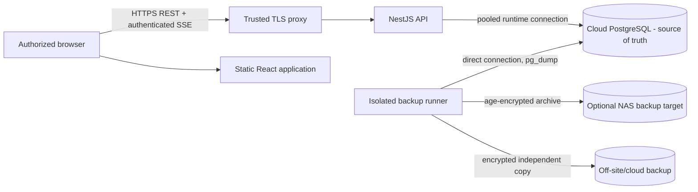

# Production Runbook

This runbook describes a controlled production pilot. `render.yaml` and `docs/DEPLOY-FREE.md` remain demo infrastructure and must not be treated as the real-data production profile.

## Runtime topology

The application has no live dependency on the NAS. The cloud-only profile omits the NAS edge without changing application code.

## Production prerequisites

- A dedicated production cloud PostgreSQL project/branch, not the demo database.
- TLS for web and API with valid DNS names.
- A reverse proxy/load balancer that supports long-lived Server-Sent Events and does not buffer or transform `text/event-stream`.
- Managed secrets, not checked-in `.env` files.
- Provider backup/PITR configured and a tested independent backup path from [BACKUP-RESTORE.md](BACKUP-RESTORE.md).
- Monitoring for readiness, process restarts, error rate, latency, storage, connection count, SSE connections, and backup freshness.
- A reviewed release artifact and a rollback artifact.
- A named operator and incident channel for the pilot.

## Required API environment

| Variable | Production rule |
|---|---|
| `APP_DEPLOYMENT_PROFILE` | `production`; startup fails if demo options or non-production `NODE_ENV` are used. |
| `NODE_ENV` | `production`. |
| `DATABASE_URL` | Pooled PostgreSQL URL for API runtime where the provider recommends it. |
| `DIRECT_URL` | Direct/unpooled URL for Prisma migrations and administrative work. |
| `WEB_ORIGIN` | Exact comma-separated HTTPS origins; no wildcard. |
| `PORT` | Assigned API port. |
| `TRUST_PROXY_HOPS` | Exact number of trusted reverse-proxy hops; normally `1`, never copied blindly. |
| `COOKIE_SAME_SITE` | `lax` for same-site deployments; `none` only when web/API are genuinely cross-site and HTTPS is enforced. |
| `SESSION_TTL_SECONDS` | Approved session lifetime. |
| `DEMO_MODE` | `false`. |
| `DEMO_LOGIN_ENABLED` | `false`. |
| `LOGIN_RATE_LIMIT_*` | Reviewed login limits. |
| `RATE_LIMIT_MAX_BUCKETS` | Bounded memory limit sized for the deployment. |
| `REALTIME_*` | Heartbeat, session recheck, per-user and global SSE limits. |

Required web build variables:

| Variable | Production rule |
|---|---|
| `VITE_API_BASE_URL` | Public HTTPS API origin. |
| `VITE_DEMO_MODE` | unset or `false`. |
| `VITE_STYLE_PREVIEW_ENABLED` | `false` unless an explicitly approved private design-review deployment requires it. |

Never expose `AUTH_SEED_PASSWORD`, database URLs, backup identities, or real legal/bank values in frontend build variables.

## Database connection policy

- Normal API traffic may use Neon's pooled URL (`-pooler` hostname) to reduce connection pressure.
- Prisma migrations, `pg_dump`, and restore use `DIRECT_URL`/a direct connection.
- Keep one API replica for the initial pilot unless the in-memory realtime broker and process-local rate limiter are replaced by shared implementations.
- Monitor active PostgreSQL connections and API saturation before changing pool or replica sizing.
- Do not run seeds automatically on every production deploy. Demo/reset seeds are forbidden for real data.

## Deployment sequence

1. Announce the change window and identify rollback owner.
2. Confirm a recent provider recovery point and a completed encrypted logical backup.
3. Restore/test the candidate backup or migration on an isolated branch when schema risk warrants it.
4. Run the complete repository validation for the exact release.
5. Build immutable API and web artifacts.
6. Apply `prisma migrate deploy` once using the direct URL. Do not run concurrent migration jobs.
7. Deploy the API and wait for `/health/live`, then `/health/ready`.
8. Deploy the web artifact.
9. Run smoke checks with controlled accounts for each enabled role.
10. Verify SSE connects, a harmless test mutation reaches another authorized browser, and an unauthorized role receives no restricted data.
11. Monitor logs, DB connections, latency, errors, and backup schedule throughout the pilot.

Readiness is intentionally `503` when PostgreSQL cannot be queried. Liveness reports only process availability and must not be used to route traffic before readiness passes.

## Reverse proxy requirements for SSE

- Keep HTTP connections open longer than the configured heartbeat interval.
- Disable response buffering and content transformation for `/realtime/events`.
- Pass cookies and CORS headers unchanged.
- Do not cache the stream.
- Preserve `X-Request-Id` or allow the API to generate it.
- Set proxy idle timeout above 65 seconds; the application sends a heartbeat by default every 15 seconds.

The API returns `X-Accel-Buffering: no`, `Cache-Control: private, no-store, no-transform`, and a heartbeat. Browser `EventSource` reconnects automatically. On every ready/reconnect signal, active queries are authoritatively refreshed to close any missed-event gap.

## Realtime scale-out gate

The current broker is process-local by design. Before deploying more than one API instance:

1. implement a shared broker adapter (for example managed Redis pub/sub or PostgreSQL LISTEN/NOTIFY with a carefully managed dedicated connection);
2. keep the existing safe event envelope and server-side audience filter;
3. replace process-local rate-limit counters with a shared/WAF-backed limiter;
4. test duplicate events, reconnect, replica termination, authorization changes, and broker outage;
5. decide whether tabs retain separate SSE connections or use browser tab coordination based on measured load.

Running multiple replicas before these gates can cause clients connected to one replica to miss mutations handled by another.

## Smoke checks

- `/health/live` returns 200 without implementation details.
- `/health/ready` returns 200 and database `ok`.
- unauthenticated API and SSE access returns 401.
- login sets secure HttpOnly session cookie; mutating requests without valid CSRF fail.
- manager, reception, technician, logistics, courier, and doctor accounts see only their permitted navigation/data.
- work creation appears on an already-open authorized technician view without refresh.
- claim/status/logistics changes update already-open relevant screens.
- billing/payment changes update manager financial screens but do not notify an unauthorized technician of a financial event.
- user deactivation/role change closes that user's SSE stream and API access is re-evaluated.
- attachment upload rejects spoofed/oversized content and download requires resource authorization.
- no demo-login or `/style-preview` is exposed in the real-data production deployment.

Use synthetic records clearly marked for pilot validation and remove/archive them through approved business flows; never run destructive reset scripts.

## Logging and monitoring

Request logs contain only method, path without query string, status, duration, request ID, and authenticated actor ID when available. Do not add bodies, cookies, tokens, raw URLs with query parameters, or patient/financial payloads.

Alert on:

- sustained `/health/ready` failure;
- crash/restart loops;
- elevated 5xx or 409 rates;
- unusual login/QR throttling;
- PostgreSQL connection exhaustion or latency;
- SSE connection limit rejection or reconnect storm;
- backup age beyond target RPO;
- restore-verification overdue;
- storage growth, especially PostgreSQL attachment bytes and audit history.

Retain logs according to the laboratory's privacy policy and applicable legal requirements. Access to logs is privileged.

## Graceful shutdown

The API enables Nest shutdown hooks. On termination it closes realtime streams with a service-unavailable event and Prisma disconnects through module teardown. The platform must send a graceful termination signal and allow a drain period before forced kill. The client reconnects and revalidates active queries against the surviving/restarted API.

## Failure and rollback

### Failed application release

1. Stop routing new traffic to the failed release.
2. Preserve logs and request IDs.
3. Roll back to the previous compatible application artifact.
4. Do not manually reverse a Prisma migration or edit migration history.
5. If the old artifact is not schema-compatible, deploy a forward corrective migration/application or restore into a new database after incident review.
6. Re-run readiness and role smoke checks before reopening traffic.

### Bad migration or data corruption

- Freeze writes immediately.
- Do not run ad-hoc destructive SQL on the only copy.
- Create a provider branch/recovery copy at the chosen point in time.
- Validate data and application compatibility in isolation.
- Switch configuration only after approval and a documented cutover.

### NAS failure

The application remains online. The backup job alerts and is retried after storage recovery. Follow [BACKUP-RESTORE.md](BACKUP-RESTORE.md); do not repoint the live application to the NAS.

### Cloud outage

Show clear request failures and avoid repeated manual submissions until the authoritative API is healthy. The frontend does not queue operational or financial writes offline. Recover or redeploy cloud services, validate readiness, then resume.

## Pilot release gate

Proceed only when:

- no known critical/high security or integrity issue remains;
- all repository suites, typecheck, build, Prisma validation, and diff checks pass;
- dependency findings are triaged;
- backup, alerting, and at least one isolated restore are evidenced;
- TLS/DNS/CORS/proxy settings are verified;
- only one API replica is active under the current local broker/limiter architecture;
- representative role and canonical workflow checks pass with production-like configuration;
- an operator can execute rollback and recovery without repository author assistance.
